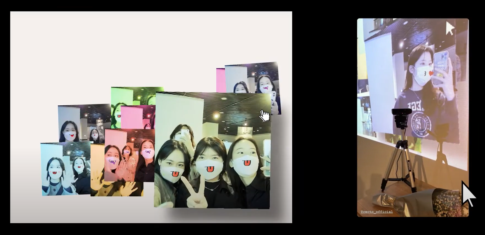

# Post-it

### 유튜브 영상 : https://youtu.be/5-9i-8_5T2g

## 작품설명
포스트 코로나를 바라는 사람들.
입을 드러내고 모일 수 있는 그날을 작품에 담았다.

## 기술스택
- JavaScript
- ml5.js(머신러닝 라이브러리)
- p5.js(이미지 프로세싱 라이브러리)

## 기능
- ml5.js를 활용해 다중 사용자 얼굴 인식
- 트래킹된 지점을 활용해 마스크 위치 예측, 다양한 입 합성
- 웹 화면에 p5.js를 활용해 합성한 기록 누적

## 회고
- 예상 타겟인 20대 여성의 인스타 스토리 공유가 활발히 일어났고, 전시의 포토존이 되었습니다.
- 사용자 인식과정이 순탄하지 않았습니다. Processing의 Open cv 라이브러리, 키네틱으로 시도를 해봤지만, 마스크를 인식하는 과정에 많은 버그가 있었습니다. ml5.js는 눈과 귀 위주로 사람을 트래킹하여 부드러운 인터렉션을 만들 수 있었습니다. 